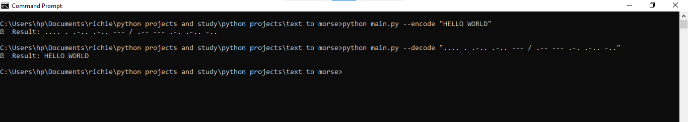

# Morse Code Converter

A clean and simple Python CLI tool that encodes and decodes Morse code. Supports both text input and file-based conversion. Built to help users convert messages securely and quickly via the command line.



---

## Table of Contents

- [Features](#features)
- [Installation](#installation)
- [Usage](#usage)
- [Examples](#examples)
- [Technologies Used](#technologies-used)
- [Project Structure](#project-structure)
- [Contributing](#contributing)
- [License](#license)
- [Contact](#contact)

---

## Features

- Encode plain text to Morse code  
- Decode Morse code to plain text  
- Encode or decode from a file  
- Save results to a file using `--output`  
- Easy-to-use CLI built with `argparse`  

---

## Installation

### Prerequisites

- Python 3.6+
- pip

### Setup

```bash
git clone https://github.com/ochiengrichie/morse-code-converter.git
cd morse-code-converter
pip install -r requirements.txt
If no requirements.txt, install manually:
pip install python-dotenv

Usage
Encode text from terminal:
python main.py --encode "HELLO WORLD"
Decode Morse from terminal:
python main.py --decode ".... . .-.. .-.. --- / .-- --- .-. .-.. -.."
Encode from file:
python main.py --encode-from-file input.txt
Decode from file:
python main.py --decode-from-file morse.txt
Save output to a file:
python main.py --encode "HELLO" --output encoded.txt

Examples
1. Encode
python main.py --encode "I LOVE PYTHON"
Output:
.. / .-.. --- ...- . / .--. -.-- - .... --- -.
2. Decode
python main.py --decode ".. / .-.. --- ...- . / .--. -.-- - .... --- -."
Output:
I Love Python

Technologies Used
Python 3
argparse
os / file I/O

Project Structure
morse-code-converter/
│
├── morse/
│   ├── encoder.py         # Handles encoding logic
│   └── decoder.py         # Handles decoding logic
│
├── main.py                # CLI entry point
├── screenshot.png         # CLI demo image
└── README.md              # Project documentation

Contributing
Contributions are welcome.
To contribute:
Fork the repository
Create a new branch
Make your changes
Open a pull request

License
MIT License © 2025 Richard Onyango

Contact
Richard Onyango
Email: ochiengrichie24@gmail.com
GitHub: @ochiengrichie